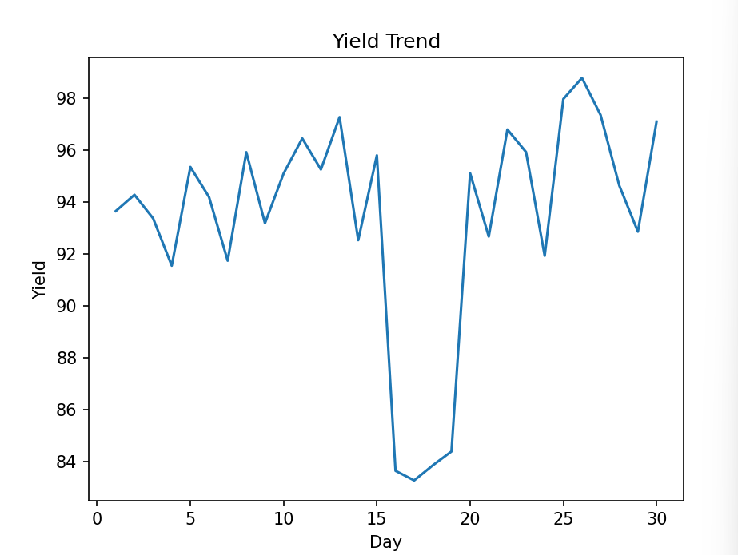

# 半導體製程良率分析與異常偵測系統

## 📌 專案簡介
本專案模擬半導體製造情境，透過製程數據分析與機器學習技術，偵測影響良率的異常狀況，並提供製程優化方向。  
展示如何運用數據分析與模型方法提升製程穩定性與產品良率。

---

## 🎯 專案目標
- 分析製程參數（溫度、壓力、良率）
- 偵測製程中的異常數據
- 找出良率下降的潛在原因
- 提供製程優化建議

---

## 🧪 功能特色
- 📊 良率趨勢分析與視覺化  
- 🔍 使用機器學習（Isolation Forest）進行異常偵測  
- ⚙️ 模擬半導體製程數據  
- 📈 標記異常區間並進行分析  

---

## 🛠️ 技術架構（Tech Stack）
- **程式語言：** Python  
- **資料分析：** Pandas、NumPy  
- **機器學習：** Scikit-learn（Isolation Forest）  
- **資料視覺化：** Matplotlib  

---

## 🏭 半導體相關知識
- 半導體製程基礎（光刻、蝕刻、薄膜沉積）  
- 製程控制（Process Control）  
- 良率分析（Yield Analysis）  
- 缺陷分析（Defect Analysis）  

---

## 1️⃣ 安裝套件

```bash
pip install pandas numpy matplotlib scikit-learn
```
---
## 📊 執行結果
- 顯示良率趨勢圖  
- 標記異常數據點  
- 輸出異常區間資料與分析結果  



```text
=== 異常資料 ===
    day  temperature   pressure      yield  anomaly
3     4   111.204466  44.057611  91.547435       -1
16   17   107.470395  46.241614  83.258406       -1
17   18    98.974209  52.332471  83.842301       -1
20   21    87.235051  47.313600  92.669700       -1
25   26    92.728172  51.284996  98.791778       -1

=== 分析結論 ===
發現 5 筆異常資料
可能原因：製程參數波動或設備異常
建議：檢查異常區間的溫度與壓力設定
---

## 🧠 專案學習重點
- 將資料分析應用於半導體製程情境  
- 使用機器學習進行異常偵測  
- 強化問題分析與根因判斷能力  

---

## 🚀 未來優化方向
- 加入 SPC（統計製程控制）圖表  
- 建立即時監控 Dashboard  
- 擴充更多製程參數提升分析精度  

---