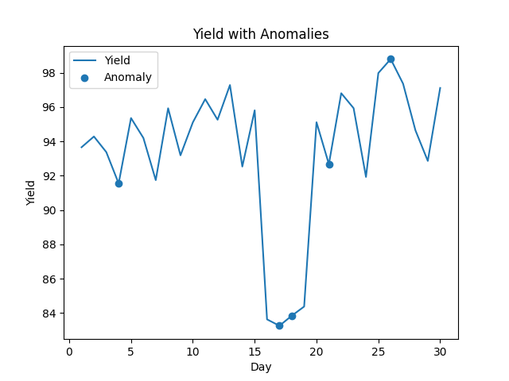

# Semiconductor Process Yield Analysis & Anomaly Detection

This project simulates a semiconductor manufacturing process and applies machine learning to detect anomalies affecting the product yield.

## Overview

The script `main.py` generates synthetic data for temperature, pressure, and yield over a 30-day period. It intentionally simulates an anomaly by deliberately dropping the yield between days 15 and 18. An `IsolationForest` machine learning model is utilized to identify these outliers based on the process parameters.

## Prerequisites

Make sure to install the required dependencies:

```bash
pip install pandas numpy matplotlib scikit-learn
```

## Running the Script

Run the main script using Python:
```bash
python main.py
```

## Output

When executing the script, it will print the text output indicating any detected anomalous events along with an analytical summary:

```text
=== 異常資料 ===
    day  temperature   pressure      yield  anomaly
3     4   111.204466  44.057611  91.547435       -1
16   17   107.470395  46.241614  83.258406       -1
17   18    98.974209  52.332471  83.842301       -1
20   21    87.235051  47.313600  92.669700       -1
25   26    92.728172  51.284996  98.791778       -1

=== 分析結論 ===
發現 5 筆異常資料
可能原因：製程參數波動或設備異常
建議：檢查異常區間的溫度與壓力設定
```

### Visualizations

The script will also open interactive plotting window displays illustrating the yield trend over time and pinpointing any detected anomalies (highlighted in orange).


